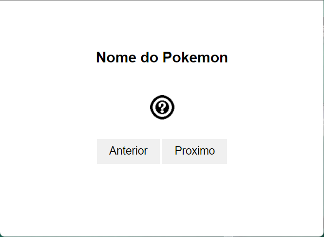

# Aprendi a Utilizar um Serviço de API

# Desafio Pokedex Utilizando pokeapi.co



Neste desafio, eu terminei de implementar o funcionamento da Pokedex usando o serviço pokeapi.co para obter as informações e imagens dos Pokémons. A Pokedex começa mostrando o primeiro Pokémon com seu nome e imagem. Quando clico nos botões "anterior" e "próximo", o Pokémon exibido muda e navega na lista de Pokémons fornecidos pela API pokeapi. Se eu clicar no botão anterior estando no primeiro Pokémon, ele vai para o último Pokémon. E se eu estiver no último e clicar em próximo, o contrário acontece: eu volto para o primeiro.


Caso eu tenha tido dúvidas, utilizei o canal da capacitação no Slack, contatei algum membro ou conversei com meu squad.

Na EngNet, usei uma ferramenta personalizada do ChatGPT para aprendizado e melhor rendimento no desenvolvimento dos projetos, chamada ZillaGPT. Eu utilizei o ZillaGPT como meu professor particular para consultar informações técnicas sobre JavaScript. [https://zillagpt.engnetconsultoria.com.br/](https://zillagpt.engnetconsultoria.com.br/)

### PokeApi

#### [Link da documentação do pokeapi.co](https://pokeapi.co/docs/v2)
https://pokeapi.co/api/v2/pokemon/?offset=0&limit=1292

Para obter as informações do Pokémon atual, utilizei o seguinte endereço de URL da API:

https://pokeapi.co/api/v2/pokemon/nome_do_pokemon

ou

https://pokeapi.co/api/v2/pokemon/numero_do_pokemon_apartir_do_numero_um

### Imagem do Pokémon

Para a imagem do Pokémon, utilizei o seguinte atributo fornecido pelo resultado da API para o Pokémon específico:

```
{
 "sprites": {
    "front_default": "https://raw.githubusercontent.com/PokeAPI/sprites/master/sprites/pokemon/X.png",
 }
}
```
