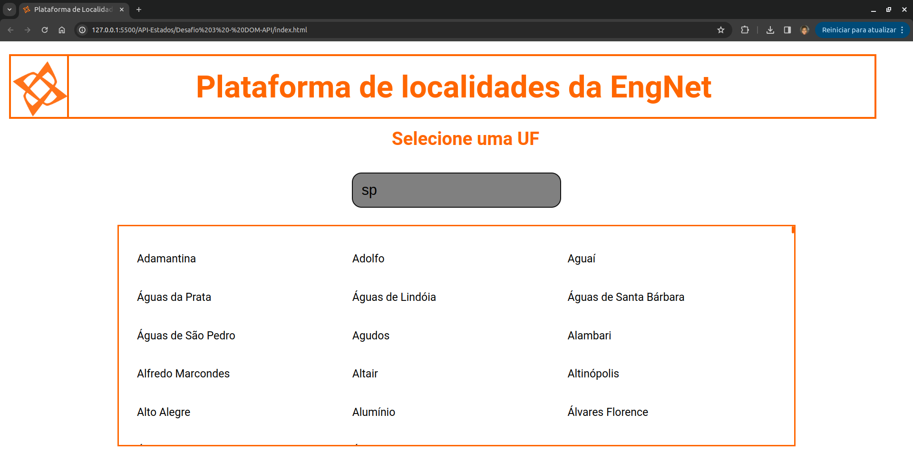
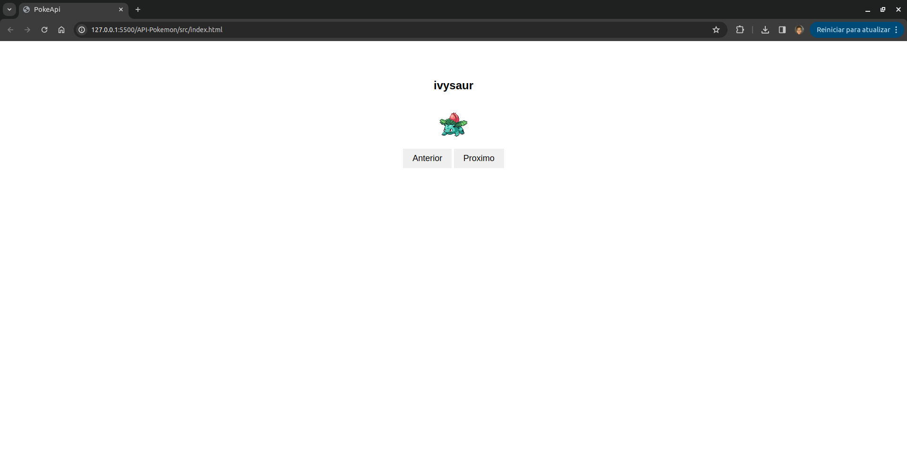
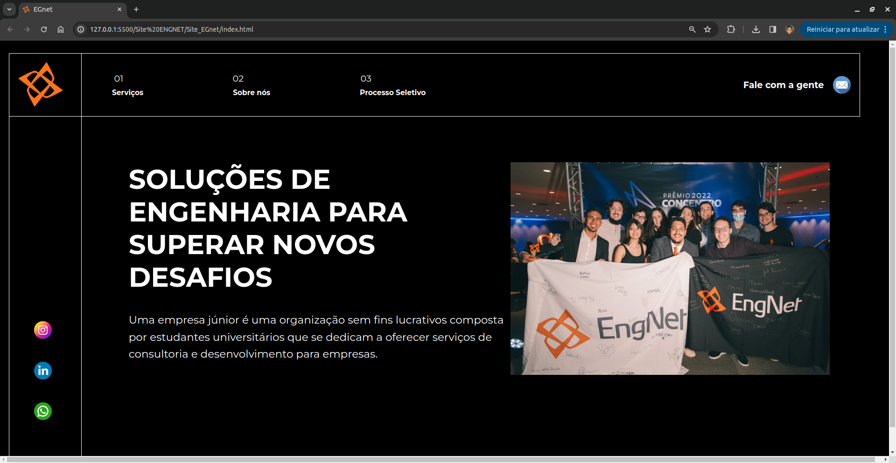
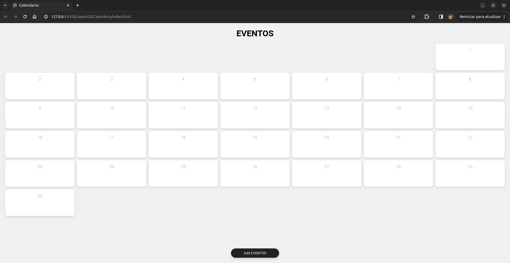
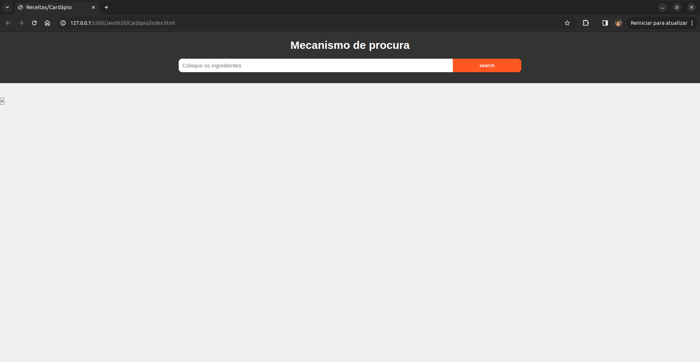
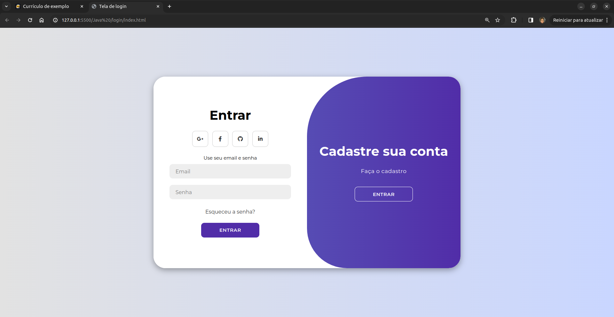
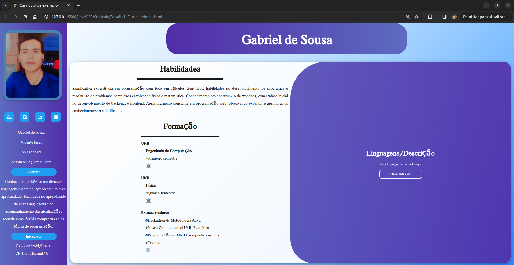
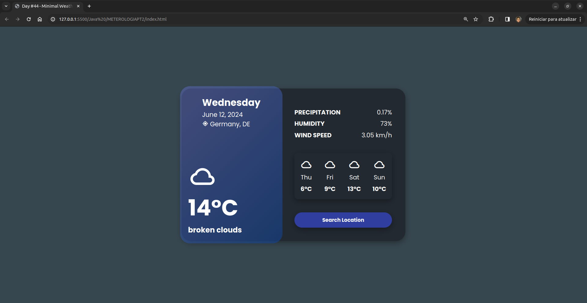
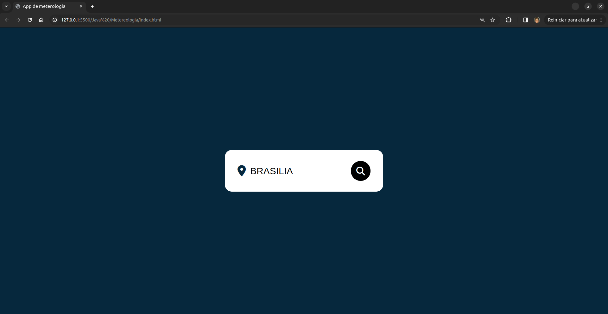

# 🌐 Trabalhos Feitos em Desenvolvimento WEB 🌐

🚀 Bem-vindo ao meu repositório! Aqui você encontrará diferentes projetos e desafios que trabalhei em desenvolvimento web. 🚀

---

### 📍 API-Estados

    

- 🌟 Projeto para criar uma aplicação que consome API de estados brasileiros.
- 📂 Clique aqui para ser direcionado para a pasta: [API-Estados](API-Estados)

---

### 🎮 API-Pokemon

    

- 🌟 Projeto para criar uma aplicação que consome API de Pokémon.
- 📂 Clique aqui para ser direcionado para a pasta: [API-Pokemon](API-Pokemon)

---

### ⚛️ React

- 🌟 Projeto para criar aplicações utilizando React.
- 📂 Clique aqui para ser direcionado para a pasta: [React](React)

---

## 🗄️ Banco de Dados

- 🌟 Projeto para gerenciar banco de dados com diferentes tecnologias.
- 📂 Clique aqui para ser direcionado para a pasta: [Banco_de_Dados]("Banco_de_dados")

---

### 🌐 Site EngNet

    

- 🌟 Projeto para criar um site para a rede de engenharia.
- 📂 Clique aqui para ser direcionado para a pasta: [Site EngNet](Site_ENGNET)

---

### 📅 Calendário

    

- 🌟 Projeto para criar um calendário de treino.
- 📂 Clique aqui para ser direcionado para a pasta: [Calendário](Calendario)

---

### 🍽️ Cardápio

    

- 🌟 Projeto para treinar o uso de APIs com um cardápio.
- 🚧 Somente um teste incompleto para uso de APIs.
- 📂 Clique aqui para ser direcionado para a pasta: [Cardápio](Cardapio)

---

### 🔐 Login

    

- 🌟 Projeto de sistema de login.
- 📂 Clique aqui para ser direcionado para a pasta: [Login](login)

---

### 📄 Currículo

    

- 🌟 Projeto para criar um currículo pessoal.
- 📂 Clique aqui para ser direcionado para a pasta: [Currículo](Curriculo)

---

### ☁️ Meteorologia PT2

    

- 🌟 Projeto de teste de API de meteorologia.
- 📂 Clique aqui para ser direcionado para a pasta: [Meteorologia PT2](METEROLOGIAPT2)

---

### ☁️ Meteorologia

    

- 🌟 Projeto de teste de API de meteorologia.
- 🚀 Primeira tentativa de uso.
- 📂 Clique aqui para ser direcionado para a pasta: [Meteorologia](Metereologia)

---

### 👟 Loja de Tênis

- 🌟 Projeto para criar um site de loja de tênis.
- 📂 Clique aqui para ser direcionado para a pasta: [Loja de Tênis](Tenis_site)

---

### 🔘 Teste do Botão

- 🌟 Projeto para testar efeitos em botões.
- 📂 Clique aqui para ser direcionado para a pasta: [Teste do Botão](Teste_do_botão)

---

### 📚 Treinos Feitos

- 🌟 Projeto para registrar passos para aprendizado.
- 📂 Clique aqui para ser direcionado para a pasta: [Treinos Feitos](Treinos_feitos)
