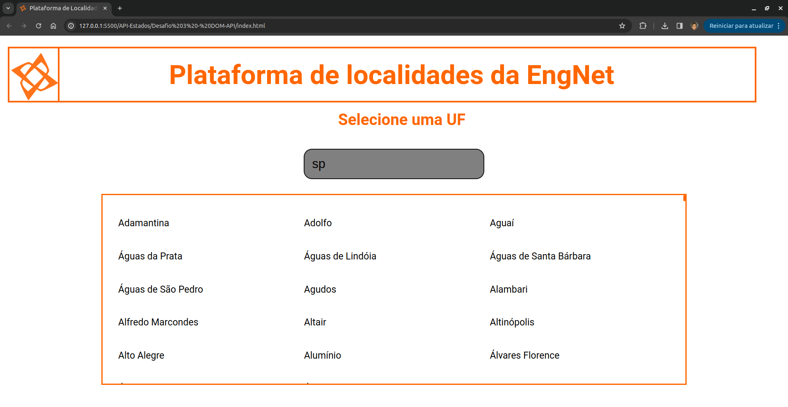
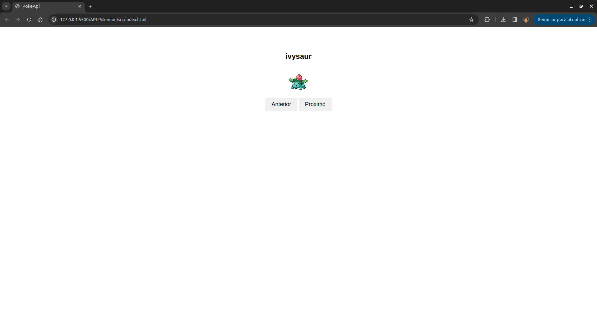
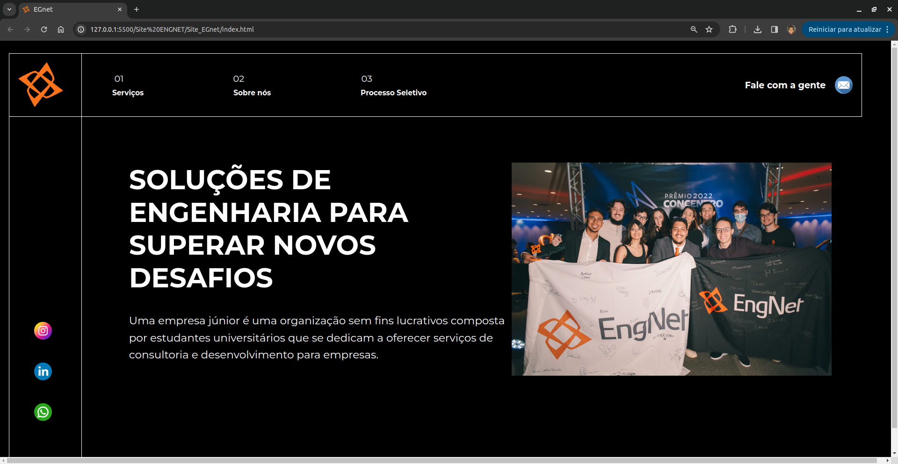
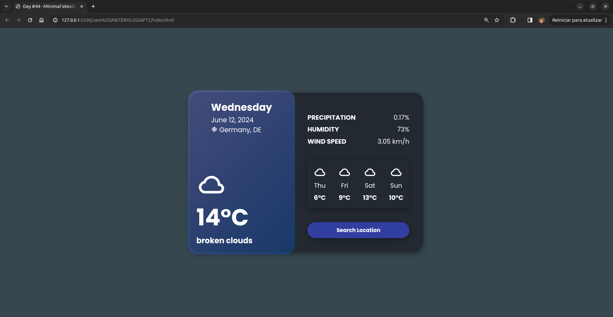
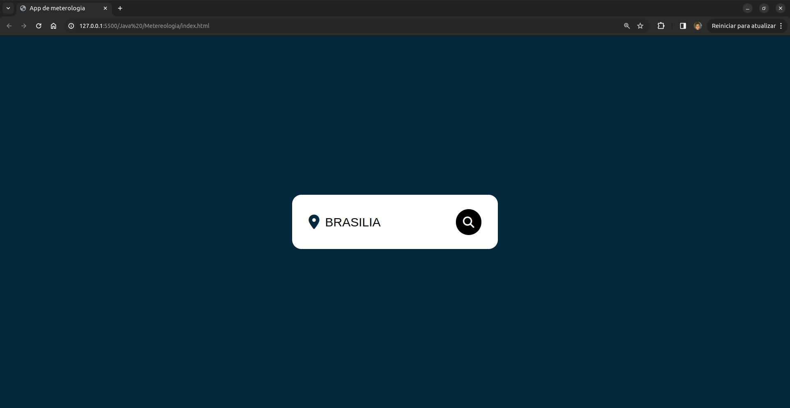

# 🌐 Trabalhos Feitos em Desenvolvimento WEB 🌐

🚀 Bem-vindo ao meu repositório! Aqui você encontrará diferentes projetos e desafios que trabalhei em desenvolvimento web. 🚀

---

### 📍 API-Estados

    

- 🌟 Projeto para criar uma aplicação que consome API de estados brasileiros.
- 📂 Clique aqui para ser direcionado para a pasta: [API-Estados](API-Estados)

---

### 🎮 API-Pokemon

    

- 🌟 Projeto para criar uma aplicação que consome API de Pokémon.
- 📂 Clique aqui para ser direcionado para a pasta: [API-Pokemon](API-Pokemon)

---

### ⚛️ React

- 🌟 Projeto para criar aplicações utilizando React.
- 📂 Clique aqui para ser direcionado para a pasta: [React](React)

---

### 🌐 Site EngNet

    

- 🌟 Projeto para criar um site para a rede de engenharia.
- 📂 Clique aqui para ser direcionado para a pasta: [Site EngNet](Site_ENGNET)

### ☁️ Meteorologia PT2

    

- 🌟 Projeto de teste de API de meteorologia.
- 📂 Clique aqui para ser direcionado para a pasta: [Meteorologia PT2](METEROLOGIAPT2)

---

### ☁️ Meteorologia

    

- 🌟 Projeto de teste de API de meteorologia.
- 🚀 Primeira tentativa de uso.
- 📂 Clique aqui para ser direcionado para a pasta: [Meteorologia](Metereologia)

